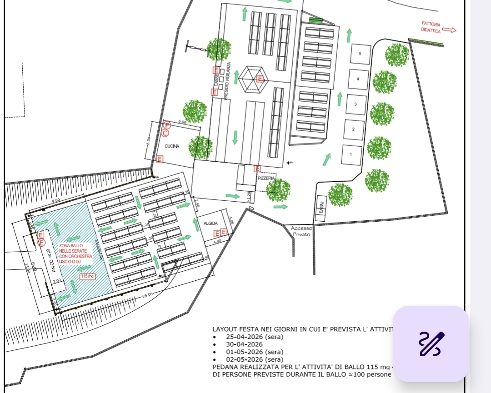

# Gestione prenotazioni — Festa della cicoria

Sistema di gestione prenotazioni tavoli per la **Festa della cicoria**, basato su **Google Sheets** e **Google Apps Script**. La numerazione dei tavoli nelle tre sale del foglio **PLANIMETRIA** è allineata alla planimetria CAD dell’area festa (vedi sotto).

*Planimetria ufficiale: **layout nei giorni in cui è prevista l’attività di ballo** (zona ballo con palco, cucina, pizzeria, servizi, flussi). In tavola — edizione **2026**: **25-04** (sera), **30-04**, **01-05** (sera), **02-05** (sera). **Zona ballo**: pedana indicata **115 m²**, capacità indicativa **≈100 persone** in fase ballo.*

## Struttura del progetto

| File | Ruolo |
|------|--------|
| `Prenotazioni.gs` | Logica principale: menu, fogli, form, assegnazione tavoli, dashboard, planimetria |
| `Tests.gs` | Test automatici in memoria (esecuzione da menu o da editor) |
| `TestGuidato.gs` | Test guidato con sidebar e scenari sulla planimetria reale del foglio |
| `Planimetria_festa_della_cicoria.jpeg` | Planimetria CAD aggiornata (layout con ballo, date 2026, metrature zona ballo) |

## Caratteristiche

- **62 tavoli** in **3 zone**: **Sala Ballo** (1–33), **Sala Chiosco** (34–48), **Sala Esterna** (49–62)
- **8 posti per tavolo**, **496 posti** totali se tutti i tavoli sono pieni
- **Tavoli accessibili**: 39, 40, 41 (fila Chiosco a sinistra, vicino all’accesso disabili)
- Priorità di riempimento: prima Sala Ballo, poi Chiosco, poi Esterna (con best-fit dentro la zona)
- Adiacenza tra tavoli definita per gruppi multi-tavolo; le tre sale **non** sono collegate tra loro nella mappa
- Foglio **PLANIMETRIA** aggiornato con lo stato delle prenotazioni
- Foglio **ISTRUZIONI** generato in fase di inizializzazione
- **Test automatici** eseguibili dall’editor Apps Script (`Tests.gs`) e **test guidato** dal menu (sidebar) per verifiche e dimostrazioni

## Installazione

### 1. Creare il Google Sheet

1. Apri [Google Fogli](https://sheets.google.com) e crea un nuovo foglio di calcolo
2. Rinominalo come preferisci (es. «Prenotazioni Festa della cicoria 2026»)

### 2. Inserire il codice Apps Script

1. Dal foglio: **Estensioni** → **Apps Script**
2. Crea o rinomina i file `.gs` in modo da avere **tre file** con il contenuto di:
   - `Prenotazioni.gs`
   - `Tests.gs`
   - `TestGuidato.gs`  
   (In un unico progetto Apps Script possono convivere più file; le funzioni sono condivise nello stesso contesto.)
3. Salva (**Ctrl+S**)

### 3. Inizializzare il sistema

1. Ricarica il foglio (**F5**)
2. Compare il menu **Gestione Fiera**
3. **Gestione Fiera** → **Inizializza Sistema**: si apre una **finestra di conferma** sul foglio (non nella sidebar) con un avviso in **grassetto** sulle prenotazioni esistenti; conferma solo se è davvero quanto intendi.
4. Alla prima esecuzione autorizza lo script quando richiesto
5. Vengono creati/aggiornati i fogli **TAVOLI**, **PRENOTAZIONI**, **DASHBOARD**, **PLANIMETRIA**, **ISTRUZIONI**

## Utilizzo (menu Gestione Fiera)

| Azione | Voce di menu |
|--------|----------------|
| Nuova prenotazione | Nuova Prenotazione |
| Modifica dati prenotazione | Modifica Prenotazione |
| Ricerca | Trova Prenotazione |
| Cancellazione | Cancella Prenotazione |
| Spostamento su altro tavolo | Sposta Prenotazione |
| Ottimizzazione manuale (consolidamento) | Consolida tavoli parziali (manuale) |
| Aggiornare riepilogo | Aggiorna Dashboard |
| Reset completo dati tavoli/prenotazioni (conferma) | Inizializza Sistema |
| Scenari sulla planimetria | Test guidato planimetria (sidebar) |

### Modifica prenotazione

1. **Cerca** la prenotazione: **per ID** (foglio PRENOTAZIONI) oppure **per nome e numero di persone** (nome come in elenco, confronto senza distinzione maiuscole/minuscole).
2. Se **più prenotazioni** hanno lo stesso nome e lo stesso numero di persone, compare un avviso con gli **ID** coinvolti: ripeti la ricerca **per ID** scegliendo la riga giusta.
3. Si aprono i campi **persone**, **telefono**, **disabili**, **note**: modifica ciò che serve e conferma con **Modifica prenotazione**. Puoi usare **Nuova ricerca** per ripartire dall’inizio.

### Cancellazione prenotazione

Stessa **ricerca** della modifica (per **ID** o **nome + persone**; in caso di ambiguità, usa l’**ID**). Dopo la ricerca vedi il **riepilogo completo** della prenotazione; **Cancella prenotazione** apre una **finestra di conferma** sul foglio (stesso tipo di dialogo dell’inizializzazione), con **Sei sicuro?** in evidenza; dopo la conferma compare un **messaggio in basso sul foglio** (toast) con l’esito.

## Come funziona l’ottimizzazione

### Assegnazione (best-fit)

In inserimento, il sistema sceglie il tavolo (o la combinazione di tavoli adiacenti) che **minimizza lo spreco di posti** rispettando zone, accessibilità e capacità.

### Auto-riorganizzazione

Se non c’è posto su un singolo tavolo, lo script può **spostare** prenotazioni più piccole tra tavoli adiacenti per liberare capacità. Gli spostamenti compaiono nel messaggio di feedback.

### Consolidamento manuale

**Consolida tavoli parziali (manuale)** analizza i tavoli parzialmente occupati e propone spostamenti per liberare interi tavoli; l’operatore può accettare o rifiutare.

## Personalizzazione

### Tavoli accessibili

In `Prenotazioni.gs`, array `TAVOLI_ACCESSIBILI` (attualmente `[39, 40, 41]`). Allineare i numeri alla planimetria reale.

### Posti diversi da 8

Dopo l’inizializzazione, modificare la colonna **Posti Totali** nel foglio **TAVOLI** per i tavoli che non hanno 8 posti.
